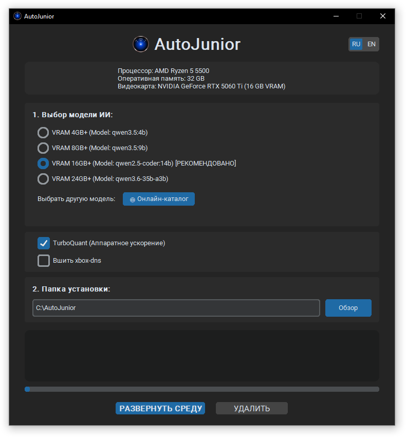
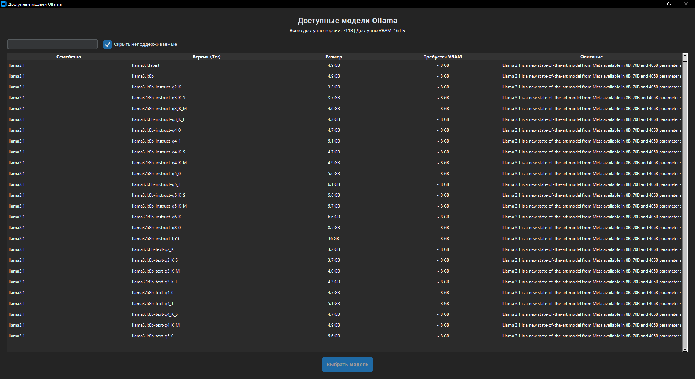
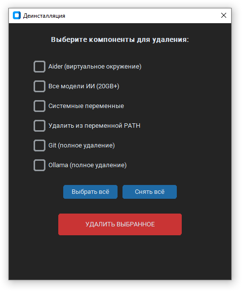

# 🚀 AutoJunior

**AutoJunior** — это интеллектуальный автоматизированный установщик и конфигуратор среды для локальной разработки с использованием ИИ. Программа за один клик развертывает связку **Ollama + Aider**, настраивает системные переменные и подбирает оптимальные модели под возможности вашего оборудования.

## 🌟 Основные возможности

* **Автоматическое определение железа**: Глубокий анализ системы через WMI и реестр Windows для получения точных данных о процессоре, RAM и объеме видеопамяти (VRAM).
* **Умные рекомендации**: Автоматический выбор наиболее производительной модели семейства Qwen (3.5 или 2.5-coder) в зависимости от объема вашей видеокарты.
* **Развертывание в один клик**: Автоматизированная установка Git, Python 3.11 и Ollama через winget, а также создание изолированного виртуального окружения (venv) для Aider.
* **Обход региональных ограничений**: Встроенная поддержка **xbox-dns.ru**. Программа патчит системный файл `hosts` для прямого доступа к серверам Ollama без использования VPN.
* **Продвинутый онлайн-каталог**: Интерактивный поиск и асинхронный парсинг всей библиотеки Ollama с автоматической фильтрацией моделей, превышающих объем вашей VRAM.
* **Локальное кэширование**: Результаты парсинга сохраняются в JSON-файл для мгновенного доступа при последующих запусках.
* **Двуязычный GUI**: Полная локализация интерфейса (RU/EN) с возможностью мгновенного переключения.
* **Модульная очистка**: Встроенный деинсталлятор позволяет корректно удалить среду, модели или системные переменные.

## 🛠 Технический стек

* **Язык**: Python 3.11+
* **GUI**: CustomTkinter (Dark Theme) + Pillow
* **Системное взаимодействие**: WMI, WinReg, psutil, subprocess
* **Сетевая часть**: Requests (Session + ThreadPoolExecutor для высокоскоростного парсинга)

## 📥 Установка и использование

### Вариант 1: Скомпилированный EXE (Рекомендуется)
1. Скачайте актуальную версию `AutoJunior_v1.0.1.exe`.
2. Запустите файл (программа автоматически запросит права администратора).
3. Выберите одну из рекомендованных моделей или найдите нужную в онлайн-каталоге.
4. Нажмите **"РАЗВЕРНУТЬ СРЕДУ"**.

### Вариант 2: Запуск из исходного кода
1. Клонируйте репозиторий.
2. Установите зависимости: `pip install -r requirements.txt`.
3. Запустите: `python autojunior.py`.

## 🖥 Скриншоты

### Онлайн-каталог моделей

### Удаление компонентов

## 📋 Как пользоваться после установки?
Программа автоматически добавляет папку установки в системную переменную `PATH` и создает лаунчер `aid.bat`.
* Откройте любой терминал (CMD или PowerShell).
* Просто введите команду `aid`.
* Aider запустится и будет готов к совместной работе над вашим кодом, используя локальную модель.

---
Разработано для эффективного старта в мире локальных LLM.
