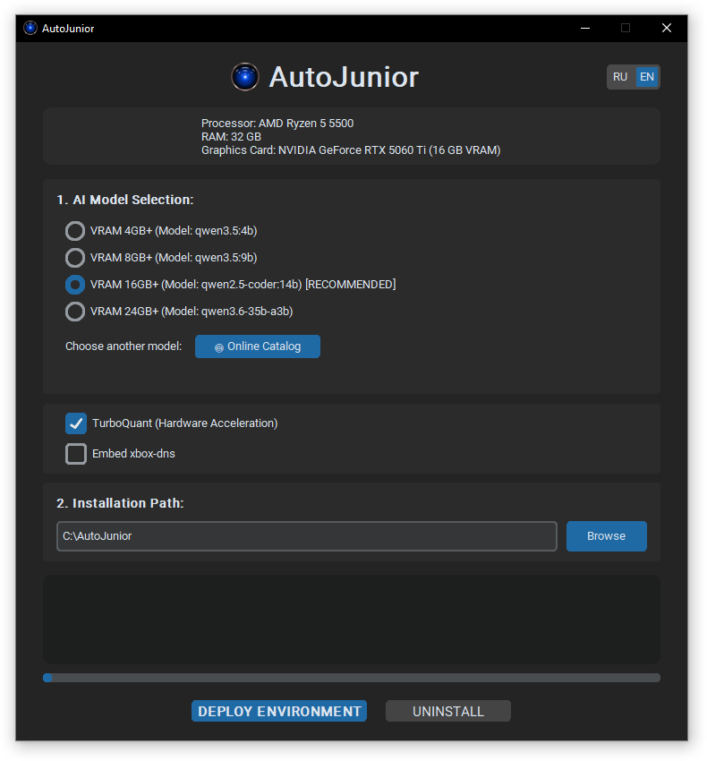
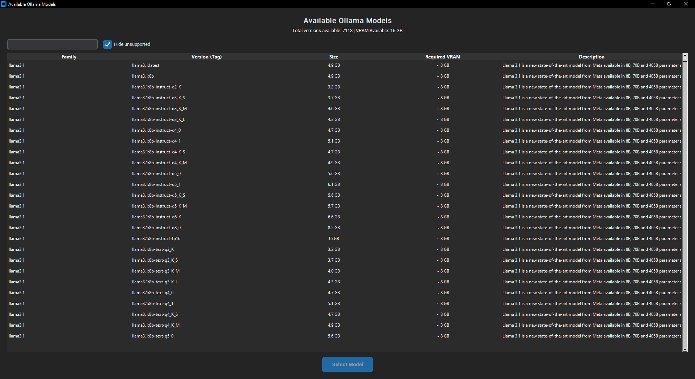
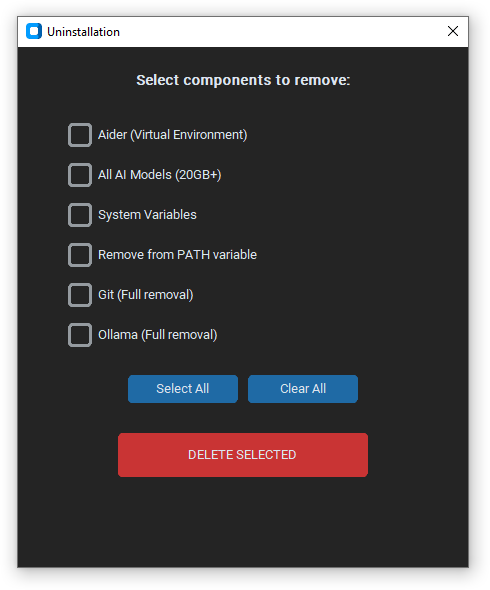

# 🚀 AutoJunior v1.0.0

**AutoJunior** is an intelligent automated environment deployer and configurator for local AI-assisted development. With a single click, it sets up the **Ollama + Aider** stack, configures system environment variables, and selects the optimal models based on your hardware specifications.

## 🌟 Key Features

* **Hardware Auto-Detection**: Deep system analysis via WMI and Windows Registry to detect CPU, RAM, and exact GPU VRAM.
* **Smart Recommendations**: Automatically selects the most capable version of the Qwen model family based on your video memory capacity.
* **One-Click Deployment**: Automates the installation of Git, Python 3.11, and Ollama via winget, while creating an isolated virtual environment (venv) for Aider.
* **Bypass Regional Blocks**: Integrated **xbox-dns.ru** support. The app can patch the system `hosts` file for direct access to Ollama servers without a VPN.
* **Advanced Online Catalog**: Interactive search and asynchronous parsing of the entire Ollama library, with a filter that hides models your hardware cannot run.
* **Local Caching**: Search results are saved to a JSON file for instant access during subsequent launches.
* **Bilingual GUI**: Full UI localization (RU/EN) with real-time language switching.
* **Modular Cleanup**: Built-in uninstaller to cleanly remove the environment, models, or system variables.

## 🛠 Technical Stack

* **Language**: Python 3.11+
* **GUI Framework**: CustomTkinter (Dark Theme) + Pillow
* **System Interaction**: WMI, WinReg, psutil, subprocess
* **Networking**: Requests (Session + ThreadPoolExecutor for high-speed scraping)

## 📥 Installation & Usage

### Method 1: Compiled EXE (Recommended)
1. Download the latest `AutoJunior_v1.0.0.exe`.
2. Run the file (it will automatically request Administrator privileges).
3. Select a recommended model or use the Online Catalog.
4. Click **"DEPLOY ENVIRONMENT"**.

### Method 2: From Source
1. Clone the repository.
2. Install dependencies: `pip install -r requirements.txt`.
3. Run: `python autojunior.py`.

## 🖥 Screenshots

### Online Model Catalog

### Removing Components

## 📋 How to start after installation?
The app automatically adds the installation folder to your system `PATH` and creates an `aid.bat` launcher.
* Open any terminal (CMD or PowerShell).
* Simply type the command `aid`.
* Aider will launch using your selected local model and will be ready to help you code.

---
Built for developers who value speed and efficiency.